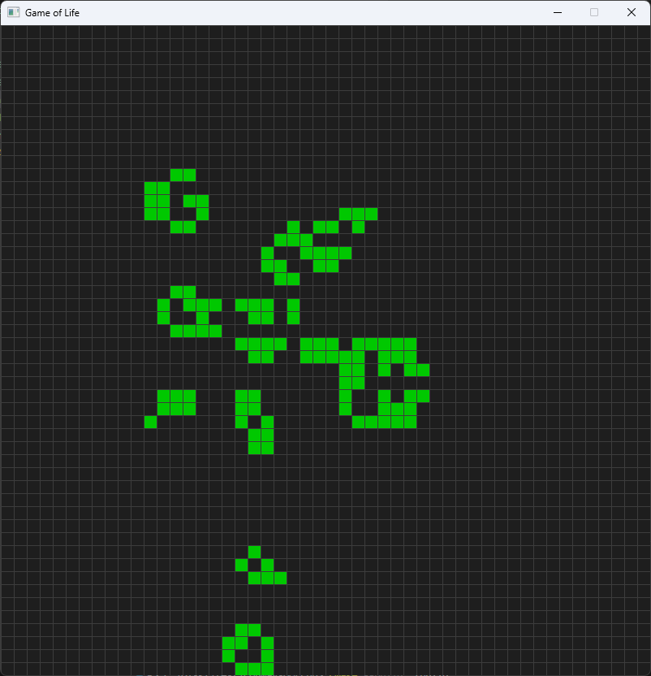

# Game of Life на C++ с использованием SDL2 и CMake

## Описание

Данное приложение реализует клеточный автомат "Игра жизнь" (Game of Life) на языке C++ с использованием графической библиотеки SDL2. Сборка проекта осуществляется через CMake.



## Требования

- Язык программирования: C++
- Графическая библиотека: SDL2
- Система сборки: CMake

## Функционал

- Реализация игры "Game of Life"
- Отображение состояния игрового поля в виде графической сетки
- Возможность установки и удаления клеток с помощью мыши
- Запуск игры на чистом поле в режиме паузы для первоначальной расстановки клеток
- Возможность ставить игру на паузу в любой момент времени
- Настройка размера игрового поля и скорости игры через параметры запуска

## Сборка и запуск

1. Установите зависимости:
   - [SDL2](https://www.libsdl.org/download-2.0.php)
   - CMake
   - Компилятор C++

2. Клонируйте репозиторий:

```bash
git clone https://github.com/BZ6/ConwaysGOLcpp.git
cd ConwaysGOLcpp
```

3. Создайте директорию для сборки и выполните сборку:

```bash
cmake -S . -B ./build
cmake --build ./build
```

4. Запустите приложение:

```bash
./ConwaysGOLcpp --width <WIDTH> --height <HEIGHT> --speed <SPEED>
```

- `--width` — ширина игрового поля (по умолчанию 50)
- `--height` — высота игрового поля (по умолчанию 50)
- `--speed` — скорость игры в миллисекундах (по умолчанию 100)

## Управление

- ЛКМ — поставить/удалить клетку
- Пробел — пауза/продолжить игру
- Esc — выход из приложения
